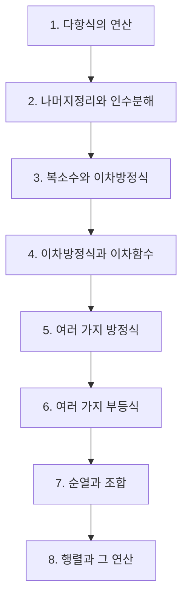

# 공통수학1

> [!abstract] 고등 수학 · 2022 개정 (고1·고2) · 대단원 8개 · 소단원 38개

## 학습 순서 (교과서 흐름)

## 단원 한눈에

| # | 단원 | 소단원 | 선수 | 영향력 |
| --- | --- | --- | --- | --- |
| 1 | [[다항식의 연산]] | 5 | 1 | 3 |
| 2 | [[나머지정리와 인수분해]] | 5 | 2 | 1 |
| 3 | [[복소수와 이차방정식]] | 7 | 2 | 6 |
| 4 | [[이차방정식과 이차함수]] | 4 | 2 | 4 |
| 5 | [[여러 가지 방정식]] | 4 | 2 | 0 |
| 6 | [[여러 가지 부등식]] | 5 | 2 | 2 |
| 7 | [[순열과 조합]] | 4 | 2 | 8 |
| 8 | [[행렬과 그 연산]] | 4 | 1 | 0 |

