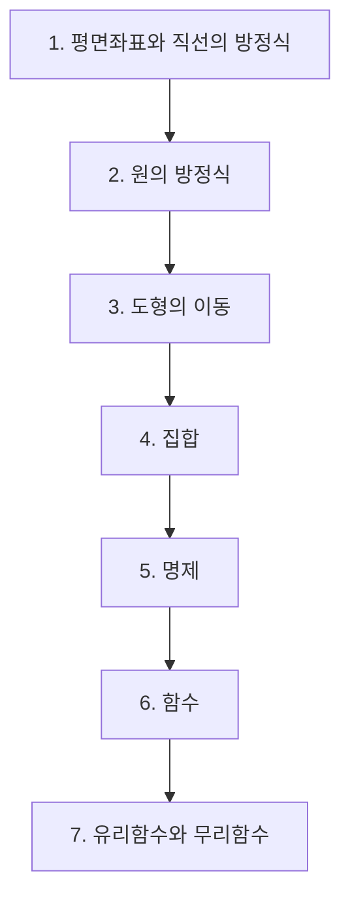

# 공통수학2

> [!abstract] 고등 수학 · 2022 개정 (고1·고2) · 대단원 7개 · 소단원 32개

## 학습 순서 (교과서 흐름)

## 단원 한눈에

| # | 단원 | 소단원 | 선수 | 영향력 |
| --- | --- | --- | --- | --- |
| 1 | [[평면좌표와 직선의 방정식]] | 5 | 2 | 6 |
| 2 | [[원의 방정식]] | 4 | 2 | 4 |
| 3 | [[도형의 이동]] | 3 | 2 | 0 |
| 4 | [[집합]] | 6 | 0 | 26 |
| 5 | [[명제]] | 6 | 0 | 1 |
| 6 | [[함수]] | 4 | 2 | 20 |
| 7 | [[유리함수와 무리함수]] | 4 | 1 | 14 |

