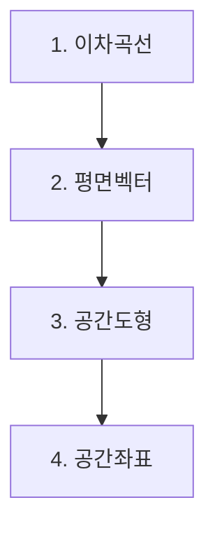

# 기하(고3)

> [!abstract] 고3 · 수능 (2015 개정) · 대단원 4개 · 소단원 16개

## 학습 순서 (교과서 흐름)

## 단원 한눈에

| # | 단원 | 소단원 | 선수 | 영향력 |
| --- | --- | --- | --- | --- |
| 1 | [[이차곡선]] | 4 | 2 | 0 |
| 2 | [[평면벡터]] | 5 | 2 | 1 |
| 3 | [[공간도형]] | 4 | 3 | 2 |
| 4 | [[공간좌표]] | 3 | 3 | 1 |

