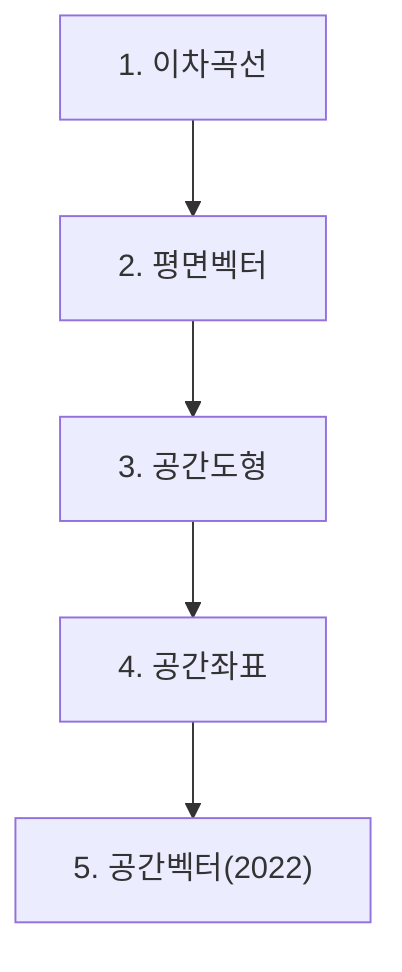

# 기하

> [!abstract] 고등 수학 · 2022 개정 (고1·고2) · 대단원 5개 · 소단원 18개

## 학습 순서 (교과서 흐름)

## 단원 한눈에

| # | 단원 | 소단원 | 선수 | 영향력 |
| --- | --- | --- | --- | --- |
| 1 | [[이차곡선]] | 4 | 2 | 0 |
| 2 | [[평면벡터]] | 5 | 2 | 1 |
| 3 | [[공간도형]] | 4 | 3 | 2 |
| 4 | [[공간좌표]] | 3 | 3 | 1 |
| 5 | [[공간벡터(2022)]] | 2 | 2 | 0 |

