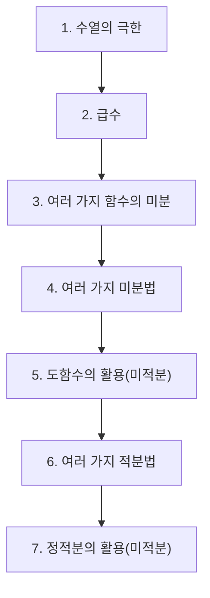

# 미적분(고3)

> [!abstract] 고3 · 수능 (2015 개정) · 대단원 7개 · 소단원 28개

## 학습 순서 (교과서 흐름)

## 단원 한눈에

| # | 단원 | 소단원 | 선수 | 영향력 |
| --- | --- | --- | --- | --- |
| 1 | [[수열의 극한]] | 3 | 4 | 1 |
| 2 | [[급수]] | 3 | 4 | 0 |
| 3 | [[여러 가지 함수의 미분]] | 5 | 3 | 6 |
| 4 | [[여러 가지 미분법]] | 5 | 2 | 5 |
| 5 | [[도함수의 활용(미적분)]] | 4 | 2 | 0 |
| 6 | [[여러 가지 적분법]] | 4 | 4 | 2 |
| 7 | [[정적분의 활용(미적분)]] | 4 | 2 | 0 |

