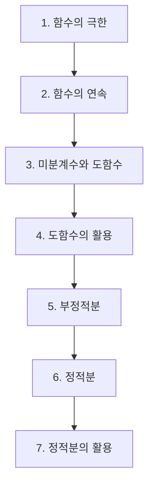

# 미적분Ⅰ

> [!abstract] 고등 수학 · 2022 개정 (고1·고2) · 대단원 7개 · 소단원 29개

## 학습 순서 (교과서 흐름)

## 단원 한눈에

| # | 단원 | 소단원 | 선수 | 영향력 |
| --- | --- | --- | --- | --- |
| 1 | [[함수의 극한]] | 5 | 2 | 13 |
| 2 | [[함수의 연속]] | 4 | 1 | 0 |
| 3 | [[미분계수와 도함수]] | 4 | 2 | 9 |
| 4 | [[도함수의 활용]] | 8 | 5 | 2 |
| 5 | [[부정적분]] | 2 | 1 | 4 |
| 6 | [[정적분]] | 3 | 1 | 3 |
| 7 | [[정적분의 활용]] | 3 | 4 | 2 |

