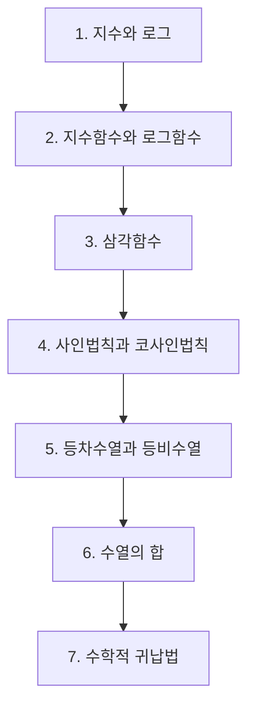

# 수학Ⅰ

> [!abstract] 고3 · 수능 (2015 개정) · 대단원 7개 · 소단원 28개

## 학습 순서 (교과서 흐름)

## 단원 한눈에

| # | 단원 | 소단원 | 선수 | 영향력 |
| --- | --- | --- | --- | --- |
| 1 | [[지수와 로그]] | 5 | 2 | 8 |
| 2 | [[지수함수와 로그함수]] | 5 | 2 | 7 |
| 3 | [[삼각함수]] | 5 | 2 | 10 |
| 4 | [[사인법칙과 코사인법칙]] | 3 | 2 | 2 |
| 5 | [[등차수열과 등비수열]] | 5 | 1 | 4 |
| 6 | [[수열의 합]] | 3 | 1 | 2 |
| 7 | [[수학적 귀납법]] | 2 | 2 | 0 |

