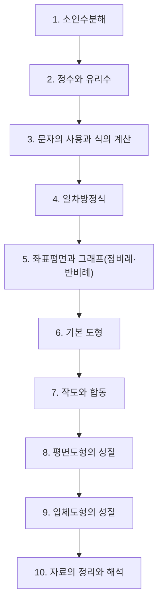

# 중1 수학

> [!abstract] 중등 수학 · 대단원 10개 · 소단원 59개

## 학습 순서 (교과서 흐름)

## 단원 한눈에

| # | 단원 | 소단원 | 선수 | 영향력 |
| --- | --- | --- | --- | --- |
| 1 | [[소인수분해]] | 7 | 0 | 31 |
| 2 | [[정수와 유리수]] | 7 | 0 | 47 |
| 3 | [[문자의 사용과 식의 계산]] | 6 | 1 | 46 |
| 4 | [[일차방정식]] | 6 | 2 | 14 |
| 5 | [[좌표평면과 그래프(정비례·반비례)]] | 5 | 0 | 31 |
| 6 | [[기본 도형]] | 8 | 0 | 26 |
| 7 | [[작도와 합동]] | 5 | 1 | 23 |
| 8 | [[평면도형의 성질]] | 5 | 1 | 8 |
| 9 | [[입체도형의 성질]] | 6 | 1 | 3 |
| 10 | [[자료의 정리와 해석]] | 4 | 0 | 4 |

