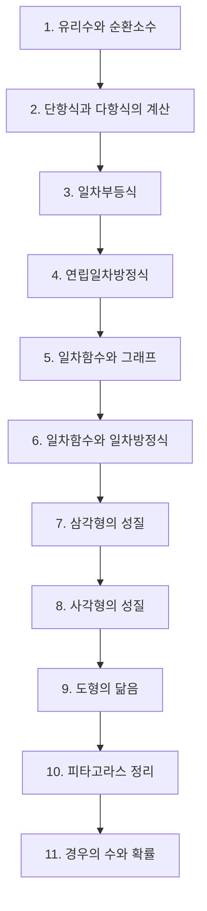

# 중2 수학

> [!abstract] 중등 수학 · 대단원 11개 · 소단원 53개

## 학습 순서 (교과서 흐름)

## 단원 한눈에

| # | 단원 | 소단원 | 선수 | 영향력 |
| --- | --- | --- | --- | --- |
| 1 | [[유리수와 순환소수]] | 4 | 1 | 0 |
| 2 | [[단항식과 다항식의 계산]] | 4 | 1 | 33 |
| 3 | [[일차부등식]] | 4 | 1 | 3 |
| 4 | [[연립일차방정식]] | 6 | 1 | 9 |
| 5 | [[일차함수와 그래프]] | 7 | 1 | 30 |
| 6 | [[일차함수와 일차방정식]] | 4 | 2 | 7 |
| 7 | [[삼각형의 성질]] | 5 | 1 | 20 |
| 8 | [[사각형의 성질]] | 5 | 1 | 0 |
| 9 | [[도형의 닮음]] | 6 | 1 | 18 |
| 10 | [[피타고라스 정리]] | 3 | 1 | 16 |
| 11 | [[경우의 수와 확률]] | 5 | 0 | 8 |

