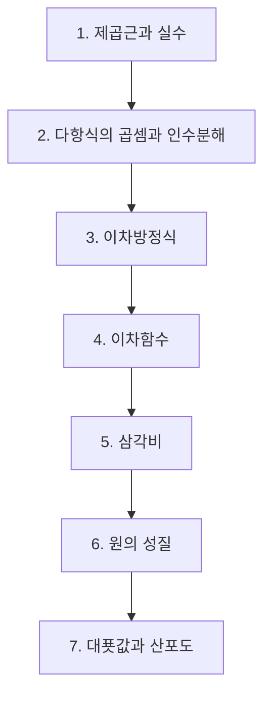

# 중3 수학

> [!abstract] 중등 수학 · 대단원 7개 · 소단원 41개

## 학습 순서 (교과서 흐름)

## 단원 한눈에

| # | 단원 | 소단원 | 선수 | 영향력 |
| --- | --- | --- | --- | --- |
| 1 | [[제곱근과 실수]] | 7 | 1 | 29 |
| 2 | [[다항식의 곱셈과 인수분해]] | 6 | 1 | 29 |
| 3 | [[이차방정식]] | 6 | 2 | 27 |
| 4 | [[이차함수]] | 5 | 2 | 24 |
| 5 | [[삼각비]] | 5 | 2 | 9 |
| 6 | [[원의 성질]] | 7 | 2 | 5 |
| 7 | [[대푯값과 산포도]] | 5 | 1 | 3 |

