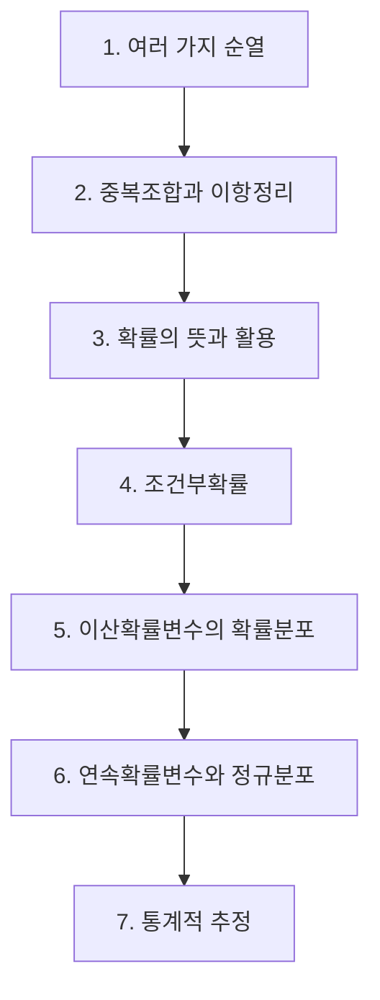

# 확률과 통계(고3)

> [!abstract] 고3 · 수능 (2015 개정) · 대단원 7개 · 소단원 27개

## 학습 순서 (교과서 흐름)

## 단원 한눈에

| # | 단원 | 소단원 | 선수 | 영향력 |
| --- | --- | --- | --- | --- |
| 1 | [[여러 가지 순열]] | 3 | 1 | 1 |
| 2 | [[중복조합과 이항정리]] | 3 | 2 | 0 |
| 3 | [[확률의 뜻과 활용]] | 5 | 3 | 4 |
| 4 | [[조건부확률]] | 4 | 1 | 3 |
| 5 | [[이산확률변수의 확률분포]] | 4 | 3 | 2 |
| 6 | [[연속확률변수와 정규분포]] | 4 | 1 | 1 |
| 7 | [[통계적 추정]] | 4 | 1 | 0 |

