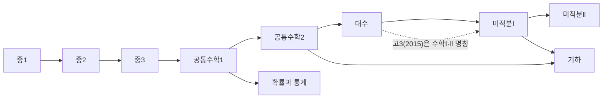

# 🏠 수학 지식그래프

대한민국 중·고등 수학 전체를 **단원 = 노트, 선수관계 = 링크**로 구운 지식그래프.
단원 노트 76개 · 선수관계 126개 · 과목 15개. 니가교수 앱의 진단 엔진과 같은 그래프를 쓴다.

## 과정 지도

## 들어가기

### 중등 수학

[[중1 수학]] · [[중2 수학]] · [[중3 수학]]

### 고등 수학 · 2022 개정 (고1·고2)

[[공통수학1]] · [[공통수학2]] · [[대수]] · [[미적분Ⅰ]] · [[확률과 통계]] · [[미적분Ⅱ]] · [[기하]]

### 고3 · 수능 (2015 개정)

[[수학Ⅰ]] · [[수학Ⅱ]] · [[확률과 통계(고3)]] · [[미적분(고3)]] · [[기하(고3)]]

## 이 볼트 100% 활용법

> [!tip] 그래프 뷰가 본체다
> 1. **그래프 뷰**(Ctrl+G)를 열고 Groups에 `tag:#영역/함수`, `tag:#영역/기하`, `tag:#영역/확률통계`, `tag:#영역/문자와식`, `tag:#영역/수와연산`, `tag:#영역/해석미적분` 색을 넣으면 영역별 커뮤니티가 보인다.
> 2. **약점 역추적**: 학생이 막힌 단원 노트를 열고 ⬅ 선수 단원을 의존도 순으로 거슬러 올라간다 — 앱의 오답 근본원인 추적과 같은 경로.
> 3. **로컬 그래프**(단원 노트에서 Ctrl+Shift+G): 그 단원의 앞뒤 생태계만 본다.
> 4. 소단원 체크박스는 검수·진도 표시용.

전체 목록은 [[INDEX]] · 허브 단원 랭킹은 [[GRAPH_REPORT]] · 유지보수 규약은 [[SCHEMA]]
